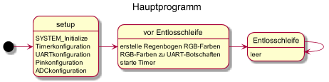
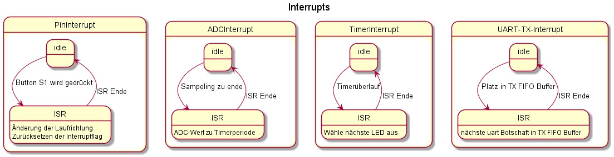
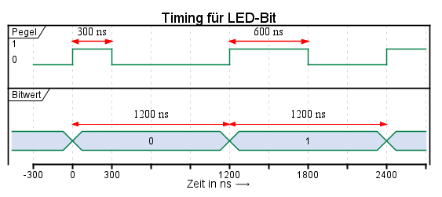
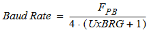
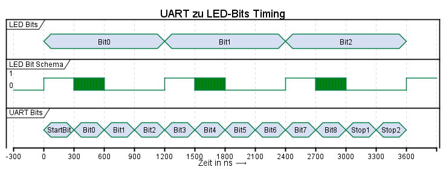

# Laborprojekt Rechnerarchitektur 2 - LED-Ansteuerung über UART von Steffen Walter und Johannes Staib

## Hardware
Das Programm ist für das *PIC32MM USB Curiosity Development Board* mit einem *PIC32MM0256GPM064 TQFP-64* vorgesehen.
### LED-Ring
Der LED-Ring ist wie folg anzuschließen, Rot an +5V, Gelb an RC12 und Schwarz an GND.
### Taster S1
Zur Richtungsänderung des Lauflichtes wird der nicht rastende Taster S1 verwendet. Dieser ist an den PinRB9 mit einem Pullup-Widerstand angeschlossen. Durch diesen ist der Taster in negativer Logik ausgeführt. Das drücken des Tasters euzeugt eine fallende Signalflanke am Pin. Eine solche kann durch die *Input Change Notification (ICN)* eine Interrupt auslösen in dem die Richtungsänderung umgesetzt ist.
### Potentiometer POT
Das Potentiometer zur einstellung der Lauflichtgeschwindigkeit ist an RC8 angeschlossen und wird auf den ADC1, Kanal 1 geführt. Durch verstellen des Potentiometers kann am Pin eine Spannung zwischen 0V und 3.3V angelegt werden. Dabei entspricht 3.3V der Analogreferenzspannung.

## SW
### Hauptprogramm

### Interrupts

## UART
### Baud Rate
Um die LEDs über UART ansteuern zukönnen ist zu erst eine passende Baudrate zu ermitteln. Aus dem benötigten Timing für die LED-Ansteuerung (siehe Abbildung: **Timing für LED-Bit**) geht hervor das die minimale benötigte Baudrate 1/300ns ist, da nur so eine Null dargestellt werden kann. 

Aus dem *PIC32MX Family Reference Manual* kann durch die nachfolgende Formel die möglichen Baud Rate, im *High Baud Rate Modus*, berechnet werden. Dabei wird die höchstfrequente verfügbare Clock, *SYSCL* mit 24MHz, als *FPB* verwendet

*Formel zur Berechnung der UART Baud Raten bei einem PIC32MX*

Durch austesten der möglichen *UxBRG* Werte un der folgenden Tabelle ist die Auswahl auf 3 Mbit/s gefallen.  
| UxBRG |0|1|2|
|-|-|-|-|
|**Baud Rate**| 6 Mbit/s | **3 Mbit/s** | 2 Mbit/s |
|Bitdauer|166,6 ns| **333,****3** **ns** | 500 ns|
Dadurch kann ein LED-Bit durch 4 Bits der UART Kommunikation gebildet werden. In einer zwölf Bit langen UART-Botschaft mit einem Startbit, neun Datenbits und zwei Stoppbits können so 3 LED-Bits übertragen werden.
### Logik Pegel
In der standardkonfiguration ist der Ruhepegel der UART-Schnittstelle der High-Pegel. Für die Ansteuerung der LEDs wird jedoch als Ruhepegel der Low-Pegel benötigt. Durch setzen des *UTXINV : Transmit Polarity Inversion bit* auf *0 =  UxTX Idle state is ‘1’* wird diese Konfiguration eingestellt.
Das Startbit beginnt dadruch durch eine positive Flanke und ist dabei die Einzeit für das erste LED-Bit. Das erste Datenbit in der UART-Botschaft ist nun der Wert ob LED-Bit ist Eins oder  LED-Bit ist Null gesendet wird. Darauf folgen zwei UART-Nullen. Das UART-Startbit und die ersten drei UART-Datenbits bilden somit das erste LED-Bit.
Das vierte und achte UART-Datenbit ist immer eine 1 um nun jeweils die immer notwendige Einzeit für die beiden weitern LED-Bits zu erzeugen. Die UART-Datenbits fünf und neunte geben wieder welcher LED-Bitwert gesendet werden soll. Zuletzt erzugen die UART-Datenbits sechs und sieben, sowie zwei Stoppbits die immer benötigte Auszeit für die zwei weitern Bits. Die normalerweise als High-Pegel auftretenden Stoppbits werden durch die invertierte Logik dabei als Low-pegel ausgegeben.
Um die Ansteuerung zu vereinfachen werden die UART-Bitmuster in Software erst in positiver Logik erstellt und erst danach bitweise invertiert.

### Bit Muster für LEDs
Um eine LED anzusteuern müssen die folgenden Bits gesendet werden.
| Byte | Bit 0 | Bit 1 | Bit 2 | Bit 3 | Bit 4 | Bit 5 | Bit 6 | Bit 7 |
|------|-------|-------|-------|-------|-------|-------|-------|-------|
|  0   |  G7   |   G6  |   G5  |   G4  |   G3  |   G2  |   G1  |   G0  |
|  1   |  R7   |   R6  |   R5  |   R4  |   R3  |   R2  |   R1  |   R0  |
|  2   |  B7   |   B6  |   B5  |   B4  |   B3  |   B2  |   B1  |   B0  |
|  3   |  W7   |   W6  |   W5  |   W4  |   W3  |   W2  |   W1  |   W0  |
Diese 32 Bits werden jeweils in Dreiergruppen gesendet, dabei entstehen 11 Bitpackete, die in Summe 33 Bits übertragen könnten. Das letze nicht benötigte Bit des letzten Bitpacketes wird dabei nicht genutzt und darf in der Übertragung weder eine Eins noch eine Null darstellen. Für die gesamte Übertragung sind dabei 11 Bitpackete mal die Anzahl der LEDs nötig, diese werden alle direkt nach einander gesendet. Danach erfolgt eine mindestens 80µs lange Pause.

### LED-Bits zu UART
Um die LED-Bits in die UART-Botschaften umzuwandeln werden die jeweiligen Byts für die LED-Farben zu erst in einzelne acht lange Bit Arrays zerlegt und dann alle Bits aller Farben in einen 33 langen Bit Array abgelegt. Dieser Array wird nun immer ein drei Bitgruppen in UART-Botschaften umgewandelt. Jede UART-Botschaft beginnt dabei mit 0b010001000 was in LED-Bits drei Nullen entspricht. Für jedes LED-Bit das eins ist wird durch eine Oder-Verknüpfung die benötigten weitern Bits gesetzt. Die Oder-Masken für die jeweiligen Bits sind in der nachfolgenden Tabelle aufgeführt. Die fertige in positiver Logik erstelle UART-Botschaft wird zuletzt dann bitweise invertiert. 
|Bit|0|1|2|
|-|-|-|-|
|Oder-Maske|0b000000001|0b000010000| 0b10000000|
Dach der Umwandlung gibt es für jede LED, mit 4 Farbwerten mit jeweils 8 Bits, elf UART-Botschaften. Diese werden in eine Array mit jeweils 16-bit pro Eintrag gespeichert. Das Übertragen der UART-Botschaften in den Sendebuffer erfolgt dann durch den Indexzugriff auf diesen Array.
